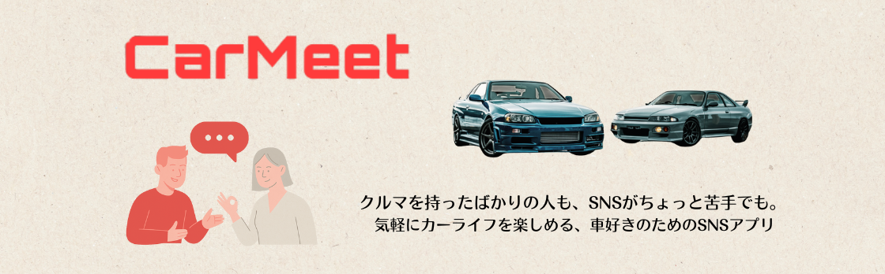
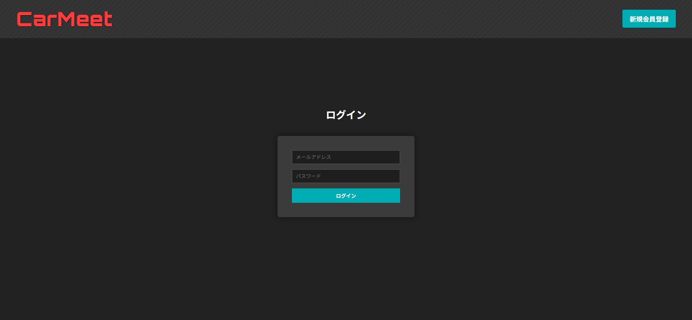
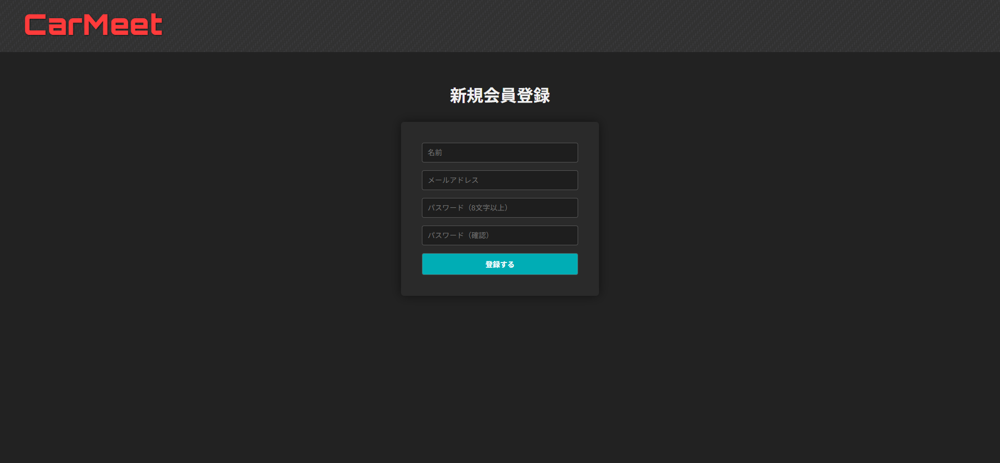
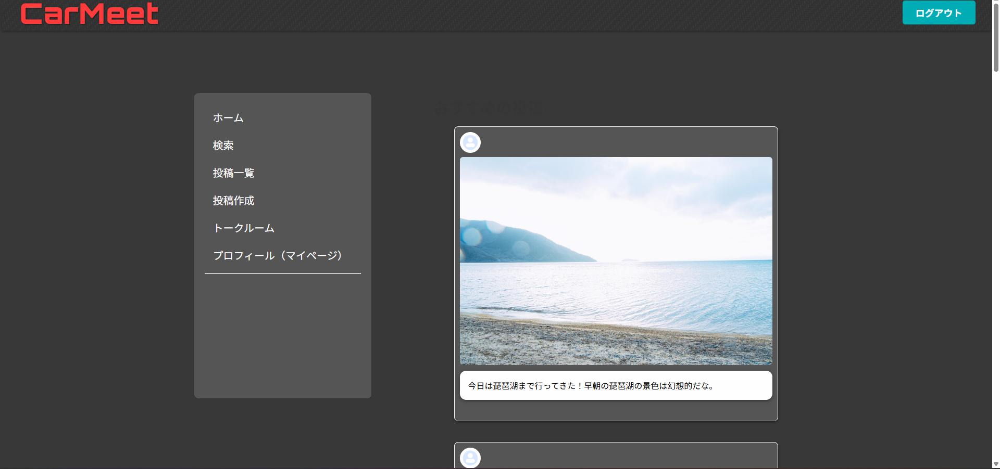
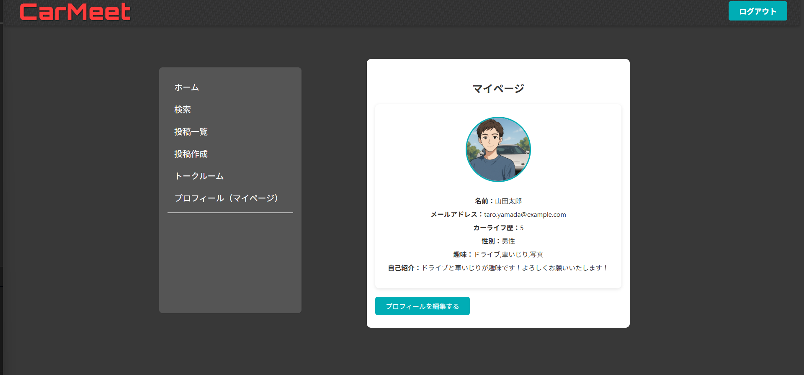
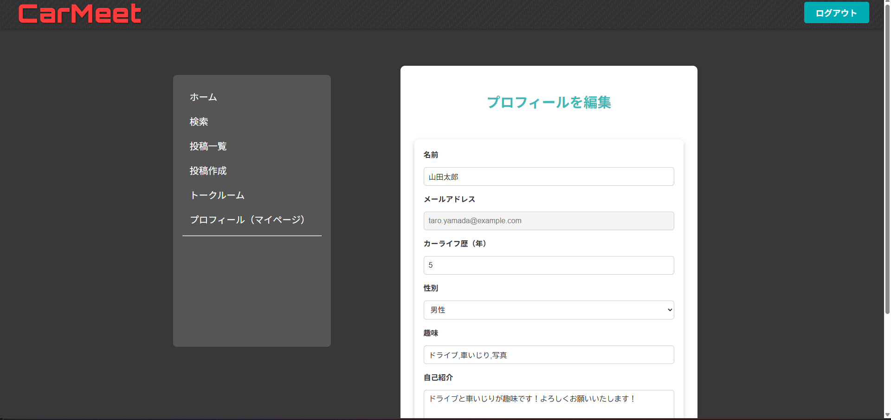
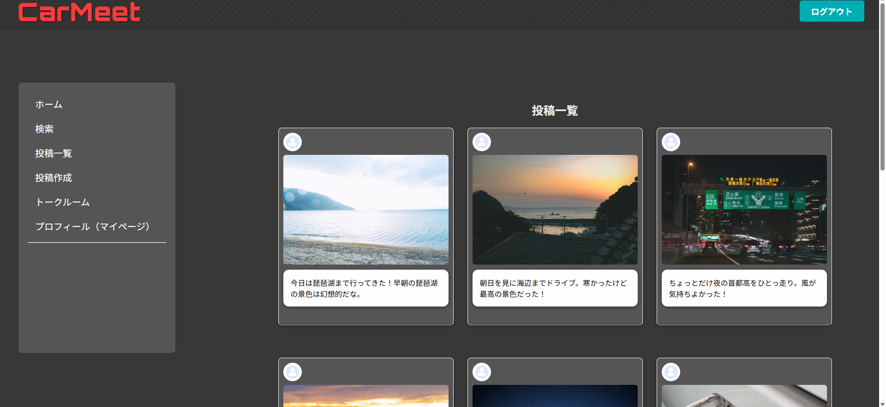

# 

## 開発背景

私はもともと車が好きなのですが、リアルでのオフ会や集まりには少しハードルの高さを感じていました。
そのため、自分のペースで関われるSNSという形に魅力を感じ、「みんカラ」や「カーチューン」といった車系SNSを試してみました。

しかし、みんカラはブログ形式で投稿のハードルが高く、カーチューンはUIが複雑で慣れるまでに時間がかかると感じました。
そういった経験から、「車は好きだけど、既存のコミュニティには馴染みにくい」と感じている人が、もっと気軽に・もっとシンプルに車を通じてつながれる場所が必要だと思うようになりました。

そこで私は、気軽に投稿できて、使いやすく、同じ車好き同士が安心して交流できるSNSアプリを自分で作ってみようと決意しました。
このCarMeetは、そうした想いから生まれたプロジェクトです。

## デモ画像

  

  

    <h2>ログイン画面</h2>
    
    

      - ユーザーがメールアドレスとパスワードを入力してログインできます。 
      - JWTを用いた認証トークンの発行処理を実装しています。
    

  

 

    <h2>新規会員登録</h2>
    
    

      - ユーザー登録が可能な画面です。 
    

  

  

    <h2>ホーム画面</h2>
    
    

      - CarMeetのトップページです。 
      - カテゴリ別の絞り込み・並び替えに対応しています。
    

  

  

    <h2>マイページ画面</h2>
    
    

      - 登録されたユーザー情報（名前・紹介・趣味など）を表示するマイページです。
    

  

  

    <h2>プロフィール編集画面</h2>
    
    

      - プロフィール情報を編集できます。 
      - 新規会員登録の項目から新たに、カーライフ歴やプロフィール画像などの追加設定ができます。
    

  

  

    <h2>投稿一覧画面</h2>
    
    

      - 投稿を評価順・予約順・新着順で並び替えて表示できます。 
      - 投稿キャプションや画像も一目で確認できるようにしています。
    

  

  

    <h2>トークルーム一覧（ワイヤーフレーム）</h2>
    
    

      - トークルームの一覧を表示する想定の画面です。 
      - クリックでトークルーム詳細に遷移する構成です（未実装）。
    

  

  

    <h2>トークルーム詳細（ワイヤーフレーム）</h2>
    
    

      - メッセージの吹き出し表示や送信フォームの配置を検討しています。 
      - ユーザーごとの発言表示を左右で分けた構成です。
    

  

  

    <h2>投稿作成画面（ワイヤーフレーム上部）</h2>
    
    

      - 投稿作成時に、タイトル・キャプション・写真 or 動画の選択ができる構成です。 
      - 入力フォームやファイル選択UIの配置を確認できます。
    

  

  

    <h2>投稿作成画面（ワイヤーフレーム下部）</h2>
    
    

      - 投稿内容の確認・カテゴリ選択・送信ボタンの配置構成です。 
      - ページ下部の構成まで見えるよう、縦に分割して表示しています。
    

  

## 🛠 技術スタック

| 種類         | 使用技術                         |
|--------------|----------------------------------|
| フロント     | HTML / CSS / JavaScript |
| バックエンド | Java                               |
| フレームワーク| SpringBoot                        |
| DB           | MariaDB                           |
| 認証         | JWT（JSON Web Token）              |
| その他       | Maven / Git / Postman / Figma     |

## ER図

  

## 今後の展望

<h3>■ 第1フェーズ：コア機能の完成</h3>
<ul>
  <li>トークルーム作成・一覧機能と投稿作成機能の実装</li>
  <li>ローカル画像管理からAmazon S3への移行</li>
  <li>投稿・プロフィールのバリデーション精度向上とUIの整理</li>
</ul>

<h3>■ 第2フェーズ：運営・管理基盤の整備</h3>
<ul>
  <li>管理者機能の実装（ユーザー・投稿の管理）</li>
  <li>投稿・通報・ブロックの管理パネル設置</li>
  <li>会員一覧・詳細、退会対応機能の構築</li>
</ul>

<h3>■ 第3フェーズ：SNSとしての拡張</h3>
<ul>
  <li>コメント機能・いいね機能の追加</li>
  <li>フォロー・ブロック・通報機能の実装</li>
  <li>タグ検索・投稿検索機能の整備</li>
</ul>

<h3>■ 第4フェーズ：コミュニケーション強化と最適化</h3>
<ul>
  <li>DM（ダイレクトメッセージ）機能</li>
  <li>通知機能（いいね・コメント・フォローなど）</li>
  <li>アクセス分析・ユーザー行動の統計機能（管理画面）</li>
</ul>
